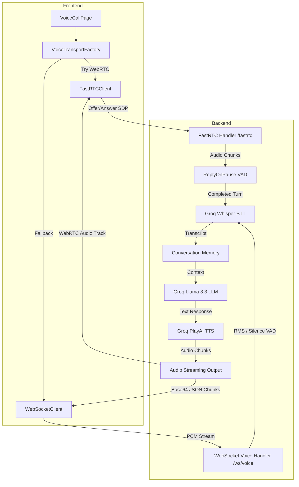

# System Architecture Report - ADhoc.ai

This document provides a comprehensive overview of the system architecture, component flows, authentication, and real-time voice streaming pipelines for the ADhoc.ai platform.

---

## 1. Project Directory Structure

```
AD1/
├── Backend/
│   ├── .python-version          # Python 3.11 version specifier
│   ├── agent_orchestrator.py    # Personality configuration, tone presets, and pace controls
│   ├── database.py              # Supabase Client instantiation
│   ├── error.log                # Backend runtime error logs
│   ├── fastrtc_handler.py       # Primary FastRTC WebRTC streaming handler
│   ├── main.py                  # Monolithic FastAPI entry point and router (to be refactored)
│   ├── requirements.txt         # Pip dependency list (UTF-16)
│   └── venv/                    # Active Python virtual environment
├── frontend/
│   ├── package.json             # React/Vite dependencies
│   ├── src/
│   │   ├── components/          # Reusable UI elements (Navbar, Bento layout, etc.)
│   │   ├── context/             # Auth context providing authentication state
│   │   ├── hooks/               # Custom hooks for DB data fetching (profile, skills, timeline)
│   │   ├── lib/                 # Core libraries (Supabase queries)
│   │   ├── pages/               # Dashboards and VoiceCallPage
│   │   ├── services/
│   │   │   └── voice/           # Voice transport layers (FastRTCClient, WebSocketClient, factory)
│   │   └── styles/              # Global styles (Tailwind CSS)
│   └── vite.config.ts           # Vite build config
├── requirements.txt             # Root duplicate python requirements file (UTF-16)
└── schema.sql                   # SQL schema blueprint (empty)
```

---

## 2. Component Flow & Architecture



---

## 3. Detailed Voice Pipelines

### 3.1 Primary Voice Pipeline (FastRTC WebRTC)
1. **Initiation:** The frontend calls `FastRTCClient.connect()`.
2. **Negotiation:**
   - The browser opens the microphone.
   - Generates local WebRTC offer SDP.
   - Sends a POST request containing SDP to `${backend}/fastrtc/webrtc/offer`.
   - The backend processes the offer and returns a remote SDP answer.
3. **Continuous Streaming:**
   - Microphone audio flows directly through WebRTC.
   - The FastRTC `ReplyOnPause` algorithm acts as the Voice Activity Detector (VAD).
4. **Processing Turn:**
   - When silence is detected, FastRTC runs the `handler`.
   - **STT:** Audio buffer is converted to WAV and transcribed using **Groq Whisper** (`whisper-large-v3-turbo`).
   - **Conversation Memory:** The transcript is appended to the local session conversation history.
   - **LLM:** Sent to **Groq Llama** (`llama-3.3-70b-versatile`) with the agent's system prompt.
   - **TTS:** The text response is sent to **Groq PlayAI TTS** (falling back to Deepgram/ElevenLabs if unavailable) to get audio bytes.
5. **Playback:** The audio chunks are streamed back to the browser speaker over the WebRTC audio track.

### 3.2 Failsafe Fallback Voice Pipeline (Manual WebSocket)
1. **Activation:** If FastRTC connection fails or throws a negotiation exception, the frontend client instantiates a `WebSocketClient` connection to `ws://localhost:8000/ws/voice/{sessionId}`.
2. **Continuous Streaming:**
   - The frontend captures audio via the browser's `AudioWorklet` (16kHz PCM).
   - Sends audio bytes as binary chunks every 500ms.
3. **Turn Detection (VAD):**
   - The backend reads binary PCM and calculates RMS amplitude.
   - If RMS falls below a threshold for `1200ms` (silence), the user's turn is considered finished.
4. **Processing Turn:**
   - Identical STT (Whisper) -> LLM (Llama) -> TTS (PlayAI/Deepgram/ElevenLabs) pipeline.
5. **Playback:** Audio bytes are Base64 encoded and sent in JSON chunks (`{"type": "audio", "data": "..."}`) to the client, which accumulates them and plays them back at 24kHz using `AudioContext`.

---

## 4. API & Authentication Flow

- **Database:** Supabase acts as the PostgreSQL database engine.
- **Authentication:**
  - Client signs up/logins via `/api/auth/signup` and `/api/auth/login`.
  - The backend returns a JWT access token.
  - The frontend stores the token in state (and local storage/cookies) and passes it in headers: `Authorization: Bearer <token>`.
  - Protected endpoints utilize a FastAPI dependency `Depends(get_current_user)` which extracts the token, queries Supabase to verify the user exists, and attaches user info.
- **Dashboard APIs:** Individual endpoints load statistics and user list details for Admin (`/api/dashboard/admin`), Students (`/api/dashboard/student`), and Faculty (`/api/dashboard/faculty`).

---

## 5. Deployment & Configuration

- **Environment Variables (.env):**
  - Configures Supabase API Key and URL.
  - Configures Groq, Deepgram, and ElevenLabs API Keys.
  - Configures Twilio credentials for telephony.
- **Docker Integration:**
  - `docker-compose.yml` mounts the Backend and frontend folders.
  - Enables single-command orchestration for production environments.
